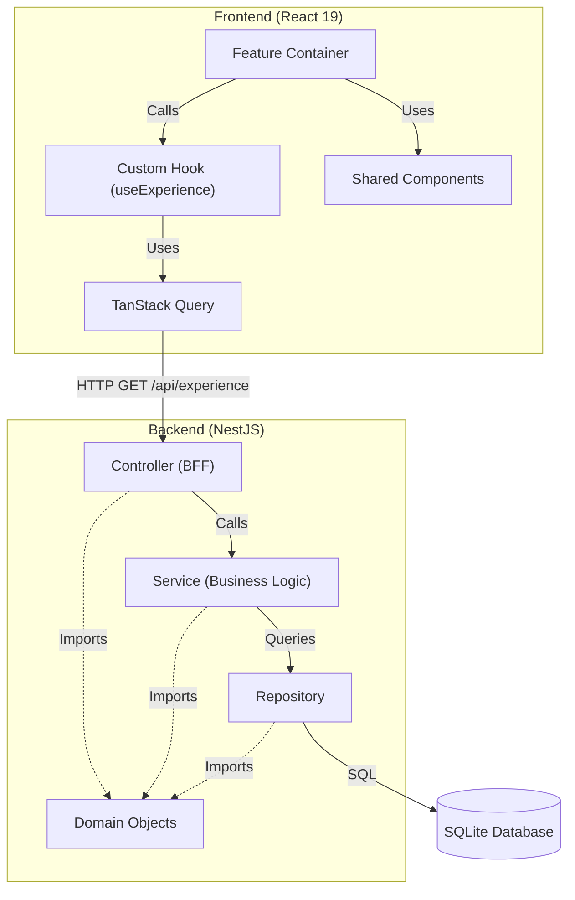

# Developer Profile

A full-stack developer profile application built with a modern React frontend and a robust NestJS backend.

## Core Technologies

### Frontend

- **Presentation Library:** React 19
- **Routing:** TanStack Router
- **Data Fetching:** TanStack Query
- **State Management:** Zustand
- **Styling:** SCSS Modules with CSS Variables
- **Build Tool:** Webpack

### Backend

- **Framework:** NestJS
- **Database:** SQLite
- **ORM:** TypeORM
- **Authentication:** Passport JWT

### Testing

- **Unit/Integration:** Jest (configured for both Node and Browser environments)
- **E2E:** Cypress

## Project Setup Instructions

1. **Clone the repository:**

   ```bash
   git clone <repository-url>
   cd profile
   ```

2. **Install dependencies:**

   ```bash
   yarn install
   ```

3. **Build the project:**

   ```bash
   yarn build
   ```

4. **Run the application:**

   - **Development mode (UI + Server):**

     ```bash
     yarn start
     ```

   - **Production mode:**

     ```bash
     yarn start:server:prod
     ```

5. **Run tests:**

   - **Unit Tests:**

     ```bash
     yarn test:ui && yarn test:server
     ```

   - **Cypress Integration Tests:**

     ```bash
     yarn cypress:open
     ```

## Architecture

This project follows a **Modular Monolith** architecture with a **Backend for Frontend (BFF)** pattern.

### Core Principles

1.  **Modular Monolith:** The application is structured as a single deployable unit but organized into distinct modules. Each feature in the UI (e.g., Experience) has a corresponding module in the backend.
2.  **Backend for Frontend (BFF):** The UI is responsible purely for presentational concerns. All data manipulation, formatting, and business logic are handled in the NestJS layer. The backend exposes endpoints specifically tailored to the needs of the frontend containers.
3.  **Domain Layer:** Domain objects are the primary vehicle for realizing intended business value.
    - **Controllers:** Must call Services (cannot call Repositories directly).
    - **Services:** Perform business interactions on data.
    - **Repositories:** Handle persistence.
    - All three layers may import and use Domain Objects.
4.  **Data Flow:**
    - **Containers:** React containers (`src/ui/*/**.container.tsx`) are the entry points for features.
    - **Data Fetching:** Data is retrieved using **TanStack Query**, which interfaces with the backend API.
    - **Backend Modules:** Dedicated NestJS modules surface data via controllers.

### Architecture Diagram



## Key Features

- **Experience Timeline:** A scrollable, animated timeline of professional experience.
- **About Section:** Detailed professional summary and skills.
- **Responsive Design:** Optimized for various screen sizes with a custom Navigation Rail.
- **Dark/Light Mode:** Theming support via CSS variables.

## Tooling and Stack Overview

- **User Interface:** React coupled with modern CSS/SCSS for responsive design.
- **Backend:** NestJS API Gateway with TypeORM integration using SQLite.
- **Testing:** Jest for unit tests and Cypress for integration tests.
- **Error Monitoring:** Sentry integrated for capturing runtime errors.
- **Language:** TypeScript for type safety and maintainability.
- **Bundling:** Webpack for building both client and server assets.

## API Endpoint Documentation

The API endpoints are documented using Swagger. Once the backend is running, you can access the API docs at:  
[http://localhost:3000/api-docs](http://localhost:3000/api-docs)
