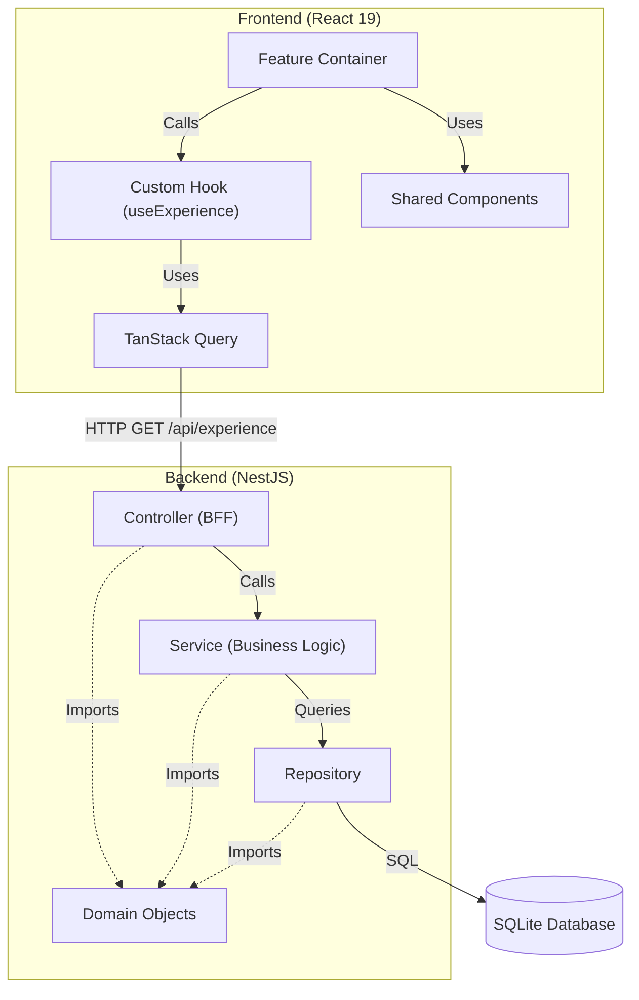

# Developer Profile

A full-stack developer profile application built with a modern React frontend and a robust NestJS backend.

## Core Technologies

### Frontend

- **Presentation Library:** React 19
- **Routing:** TanStack Router
- **Data Fetching:** TanStack Query
- **State Management:** Zustand
- **Authentication:** Axios Interceptors (JWT)
- **Styling:** SCSS Modules with CSS Variables
- **Build Tool:** Webpack

### Backend

- **Framework:** NestJS
- **Database:** SQLite
- **ORM:** TypeORM
- **Authentication:** Passport JWT

### Testing

- **Unit/Integration:** Jest (configured for both Node and Browser environments)
- **Quality Gates:** Husky `pre-push` hooks enforce strict testing, linting, and dependency validation before code can be pushed.

## Project Setup Instructions

1. **Clone the repository:**

   ```bash
   git clone <repository-url>
   cd profile
   ```

2. **Install dependencies:**

   ```bash
   npm install
   ```

3. **Editor Setup (Recommended):**

   Open the project in **VS Code** and accept the prompt to install the recommended extensions (ESLint, Prettier, Jest, Dependency Cruiser).

4. **Build the project:**

   ```bash
   npm run build
   ```

5. **Run the application:**
   - **Development mode (UI + Server):**

     ```bash
     npm start
     ```

   - **Production mode:**

     ```bash
     npm run start:server:prod
     ```

6. **Run tests:**
   - **All Tests:**

     ```bash
     npm test
     ```

7. **Docker:**
   - **Build:**

     ```bash
     docker build -t profile-app .
     ```

   - **Run:**

     ```bash
     docker run -p 3000:3000 profile-app
     ```

## Environment Variables

Copy the example file and configure your environment:

```bash
cp .env.example .env
# Edit .env with your values
```

See [.env.example](.env.example) for all available variables. Key variables:

| Variable          | Required | Description                                                          |
| ----------------- | -------- | -------------------------------------------------------------------- |
| `JWT_AUTH_SECRET` | Yes      | Secret key for signing JWTs. Generate with `openssl rand -base64 32` |
| `SENTRY_DSN`      | No       | Sentry DSN for error tracking                                        |
| `PORT`            | No       | Server port (default: 3000)                                          |

## Architecture

This project follows a **Modular Monolith** architecture with a **Backend for Frontend (BFF)** pattern.

### Core Principles

1.  **Modular Monolith:** The application is structured as a single deployable unit but organized into distinct modules. Each feature in the UI (e.g., Experience) has a corresponding module in the backend.
2.  **Backend for Frontend (BFF):** The UI is responsible purely for presentational concerns. All data manipulation, formatting, and business logic are handled in the NestJS layer. The backend exposes endpoints specifically tailored to the needs of the frontend containers.
3.  **Domain Layer:** Domain objects are the primary vehicle for realizing intended business value.
    - **Controllers:** Must call Services (cannot call Repositories directly).
    - **Services:** Perform business interactions on data.
    - **Repositories:** Handle persistence.
    - All three layers may import and use Domain Objects.
4.  **Data Flow:**
    - **Containers:** React containers (`src/ui/*/**.container.tsx`) are the entry points for features.
    - **Data Fetching:** Data is retrieved using **TanStack Query**, which interfaces with the backend API.
    - **Backend Modules:** Dedicated NestJS modules surface data via controllers.

### Architecture Diagram



## Feature Architecture

Detailed architectural documentation for each feature can be found here:

- [About Feature](architecture/components/about.md)
- [Experience Feature](architecture/components/experience.md)
- [Projects Feature](architecture/components/projects.md)
- [Blog Feature](architecture/components/blog.md)

## Architectural Decisions

- [ADR-001: Persistent Storage for Blog](architecture/decisions/ADR-001-persistent-storage-for-blog.md)
- [ADR-002: SQLite & TypeORM](architecture/decisions/ADR-002-SQLite-TypeOrm-for-persistence.md)
- [ADR-003: Centralized Axios Interceptors](architecture/decisions/ADR-003-centralized-axios-interceptors.md)

## Key Features

- **Experience Timeline:** A scrollable, animated timeline of professional experience.
- **Projects Showcase:** A detailed portfolio of technical projects with role, execution, and results.
- **About Section:** Detailed professional summary and skills.
- **Technical Blog:** A markdown-based blogging platform with syntax highlighting and diagram support.
- **Responsive Design:** Optimized for various screen sizes with a custom Navigation Rail.
- **Dark/Light Mode:** Theming support via CSS variables.

## Tooling and Stack Overview

- **User Interface:** React coupled with modern CSS/SCSS for responsive design.
- **Backend:** NestJS API Gateway with TypeORM integration using SQLite.
- **Testing:** Jest for unit and integration tests.
- **Error Monitoring:** Sentry integrated for capturing runtime errors.
- **Language:** TypeScript for type safety and maintainability.
- **Bundling:** Webpack for building both client and server assets.

## API Endpoint Documentation

The API endpoints are documented using Swagger. Once the backend is running, you can access the API docs at:  
[http://localhost:3000/api/docs](http://localhost:3000/api/docs)
