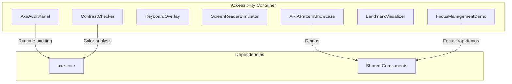

# Accessibility Showcase Feature Architecture

## Overview

The Accessibility Showcase provides interactive demonstrations of WCAG 2.1 AA compliance techniques, including real-time accessibility auditing, contrast checking, keyboard navigation, and ARIA pattern implementations.

**Route:** `/accessibility`  
**Live Site:** [reillygoulding.ca/accessibility](https://www.reillygoulding.ca/accessibility)

## Purpose

This feature serves multiple purposes:

1. **Compliance Demonstration**: Showcase WCAG 2.1 AA compliance across the portfolio
2. **Developer Education**: Interactive examples of accessibility best practices
3. **Audit Tooling**: Real-time axe-core auditing with remediation guidance
4. **Pattern Reference**: Live demonstrations of ARIA patterns used in production components

## Architecture Diagram



## Component Breakdown

### AxeAuditPanel

Real-time accessibility auditing using axe-core:

- **On-demand scanning**: Audit current page or specific sections
- **Violation reporting**: Severity levels (critical, serious, moderate, minor)
- **Remediation links**: Deque University references for each violation
- **WCAG mapping**: Maps violations to specific WCAG criteria

### ContrastChecker

Interactive color contrast verification:

- **WCAG thresholds**: Tests AA (4.5:1 normal, 3:1 large) and AAA (7:1 normal, 4.5:1 large)
- **Color picker**: Interactive foreground/background selection
- **Real-time preview**: Live text rendering at different sizes
- **Pass/fail indicators**: Clear visual feedback on compliance

### KeyboardOverlay

Keyboard navigation demonstration and monitoring:

- **Key visualization**: Shows pressed keys in real-time
- **Focus tracking**: Highlights currently focused element
- **Tab order display**: Visualizes logical tab sequence
- **Keyboard shortcuts**: Documents available shortcuts

### ScreenReaderSimulator

Approximate screen reader output demonstration:

- **Announcement preview**: Shows what AT would announce
- **Role/name/state**: Displays computed accessible properties
- **Live region monitoring**: Captures `aria-live` announcements
- **Caveat display**: Notes that this is a simulation, not a real AT

### FocusManagementDemo

Interactive focus trap and management demonstrations:

- **Modal focus trap**: Demonstrates correct dialog focus handling
- **Focus restoration**: Shows return focus patterns
- **Skip links**: Demonstrates skip-to-main-content pattern
- **Focus visible**: Highlights `:focus-visible` vs `:focus`

### LandmarkVisualizer

Page structure visualization:

- **Landmark overlay**: Highlights `<main>`, `<nav>`, `<aside>`, etc.
- **Heading outline**: Shows heading hierarchy (h1-h6)
- **Region labels**: Displays `aria-label` values
- **Structure warnings**: Flags missing or duplicate landmarks

### ARIAPatternShowcase

Live demonstrations of ARIA patterns from portfolio components:

- **NavigationRail**: `aria-expanded`, landmark navigation
- **SignInModal**: Focus trap, `aria-modal`, escape handling
- **Skeleton**: `role="status"`, `aria-busy` loading states
- **Card**: Semantic `<article>` rendering
- **Button/LinkButton**: `aria-disabled` vs `disabled`

## Key Dependencies

- **axe-core**: Industry-standard accessibility testing engine
- **@testing-library/jest-dom**: ARIA attribute assertions in tests
- **Shared Components**: Real production components for demos

## Testing Strategy

### Three-Layer Approach

| Layer           | Tool                        | Purpose                             |
| --------------- | --------------------------- | ----------------------------------- |
| **Unit**        | `jest-axe`                  | Component-level violation detection |
| **Integration** | `@testing-library/jest-dom` | ARIA attribute and role assertions  |
| **E2E**         | `@axe-core/playwright`      | Full-page audits in real browser    |

### Self-Verifying Demos

Each demo component audits itself:

```typescript
import { axe, toHaveNoViolations } from 'jest-axe';

expect.extend(toHaveNoViolations);

test('FocusManagementDemo has no accessibility violations', async () => {
  const { container } = render(<FocusManagementDemo />);
  expect(await axe(container)).toHaveNoViolations();
});
```

### Manual Testing Requirements

Automated tools catch ~30-50% of issues. Manual verification includes:

- Screen reader testing (NVDA on Windows, VoiceOver on macOS)
- Keyboard-only navigation through all flows
- 200% zoom without content loss
- Reduced motion preference respected

## Related ADRs

- [ADR-026: Accessibility Testing Architecture](../decisions/ADR-026-accessibility-testing-architecture.md)
- [ADR-027: ARIA Patterns Implementation](../decisions/ADR-027-aria-patterns-implementation.md)

## WCAG 2.1 AA Compliance Standards

This project targets **WCAG 2.1 Level AA** compliance. See the [WCAG Compliance Guide](./wcag-compliance.md) for implementation requirements across all features.
