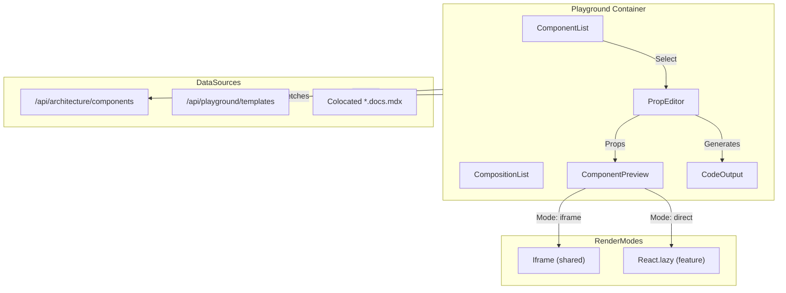

# Component Playground Feature Architecture

## Overview

The Component Playground provides an interactive environment for browsing, customizing, and previewing shared UI components and feature compositions. It supports live prop editing, code generation, and dual render modes for different component types.

**Route:** `/playground`  
**Component Detail Route:** `/playground/$componentId`  
**Live Site:** [reillygoulding.ca/playground](https://www.reillygoulding.ca/playground)

## Purpose

This feature serves multiple purposes:

1. **Component Discovery**: Browse all available shared and feature components
2. **Interactive Development**: Customize props and see live previews
3. **Code Generation**: Generate copy-paste ready JSX for component usage
4. **Composition Templates**: Pre-built layouts combining multiple components
5. **Documentation**: Colocated MDX documentation for each component

## Architecture Diagram



## Dual Render Mode Strategy

### Iframe Rendering (Shared Components)

Default mode for base shared components (`Button`, `Badge`, `Card`, `Skeleton`, `LinkButton`):

- **Sandboxed preview**: Component renders in isolated iframe
- **Style isolation**: Prevents CSS leakage between playground and preview
- **Safe for simple components**: No external dependencies beyond React

### Direct Rendering (Feature Components)

Used for feature components that require runtime dependencies:

- **React.lazy loading**: Code-split imports via `ComponentRegistry`
- **Full dependency access**: Components can use recharts, axe-core, etc.
- **Portfolio integration**: Demonstrates real component behavior

```typescript
// ComponentRegistry.ts
export const ComponentRegistry: Record<
  string,
  () => Promise<React.ComponentType>
> = {
  MetricsChart: () =>
    import('ui/containers/performance/components/MetricsChart'),
  AxeAuditPanel: () =>
    import('ui/containers/accessibility/components/AxeAuditPanel'),
  // ...
};
```

## Component Breakdown

### ComponentList

Sidebar listing of available components:

- **Category grouping**: Shared, Performance, Accessibility, etc.
- **Search/filter**: Quick component lookup
- **Selection state**: Highlights active component

### PropEditor

Interactive prop customization panel:

- **Type-aware controls**: Boolean → toggle, string → input, enum → select
- **Nested prop support**: Object and array props with JSON editing
- **Sample data**: Feature components include realistic defaults
- **Validation**: Type checking against component prop types

### ComponentPreview

Live component rendering area:

- **Viewport toggle**: Mobile, tablet, desktop widths
- **Theme toggle**: Light/dark mode preview
- **Error boundary**: Graceful handling of render errors
- **Loading state**: Skeleton while lazy components load

### CodeOutput

Generated code display:

- **JSX output**: Copy-paste ready component usage
- **Import statement**: Correct import path for the component
- **Syntax highlighting**: via react-syntax-highlighter

### CompositionList / CompositionEditor

Template-based layouts for combining components:

- **Predefined templates**: Dashboard, metrics panel, status grid
- **Grid layout system**: CSS Grid with data-attribute positioning
- **Slot-based props**: Configure props for each component in template
- **No arbitrary code**: Templates are JSON configurations, not executable code

## Self-Contained Components

Components with `selfContained: true` render as live demos without prop editing:

```typescript
// Metadata example
{
  name: 'AxeAuditPanel',
  category: 'accessibility',
  selfContained: true,
  renderMode: 'direct',
  description: 'Real-time accessibility auditing panel'
}
```

These components display an informational note instead of prop controls.

## Dependency Cruiser Exceptions

The playground container has explicit exceptions in `.dependency-cruiser.js`:

- **`feature-isolation`**: Allows importing from other containers
- **`feature-components-internal-only`**: Allows accessing container internals

This is narrowly scoped to the playground container only.

## Backend API

### `GET /api/architecture/components`

Returns component metadata extracted at build time:

```typescript
interface ComponentMetadata {
  name: string;
  category: 'shared' | 'performance' | 'accessibility' | 'case-studies';
  path: string;
  props: PropDefinition[];
  renderMode: 'iframe' | 'direct';
  selfContained?: boolean;
  sampleData?: Record<string, unknown>;
}
```

### `GET /api/playground/templates`

Returns composition template definitions:

```typescript
interface CompositionTemplate {
  id: string;
  name: string;
  description: string;
  layout: 'grid-2x2' | 'grid-3x1' | 'dashboard';
  slots: ComponentSlot[];
}
```

## Testing Strategy

### Container Integration Tests

```typescript
// playground.container.test.tsx
describe('PlaygroundContainer', () => {
  it('renders component list from API', async () => {
    render(<PlaygroundContainer />);
    await waitFor(() => {
      expect(screen.getByRole('list')).toBeInTheDocument();
    });
  });

  it('switches between components and compositions tabs', async () => {
    const user = userEvent.setup();
    render(<PlaygroundContainer />);

    await user.click(screen.getByRole('tab', { name: /compositions/i }));
    expect(screen.getByRole('tab', { selected: true })).toHaveTextContent('Compositions');
  });
});
```

### MSW Handlers

```typescript
// handlers.ts
export const playgroundHandlers = [
  http.get('/api/architecture/components', () => {
    return HttpResponse.json([
      { name: 'Button', category: 'shared', renderMode: 'iframe' },
      // ...
    ]);
  }),
];
```

## Key Dependencies

- **React.lazy**: Code-splitting for feature components
- **Zustand**: Playground state (selected component, props, tab)
- **TanStack Query**: Component metadata fetching
- **react-syntax-highlighter**: Code output display

## Related ADRs

- [ADR-029: Feature Component Playground Strategy](../decisions/ADR-029-feature-component-playground-strategy.md)
- [ADR-030: Colocated MDX Component Documentation](../decisions/ADR-030-colocated-mdx-component-documentation.md)
- [ADR-018: Container-Component Pattern](../decisions/ADR-018-container-component-pattern.md)
