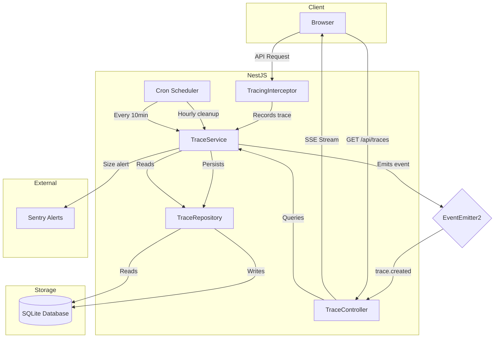
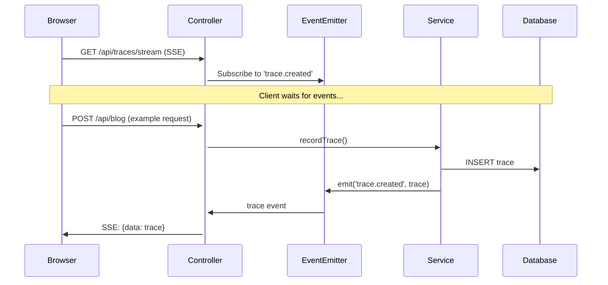
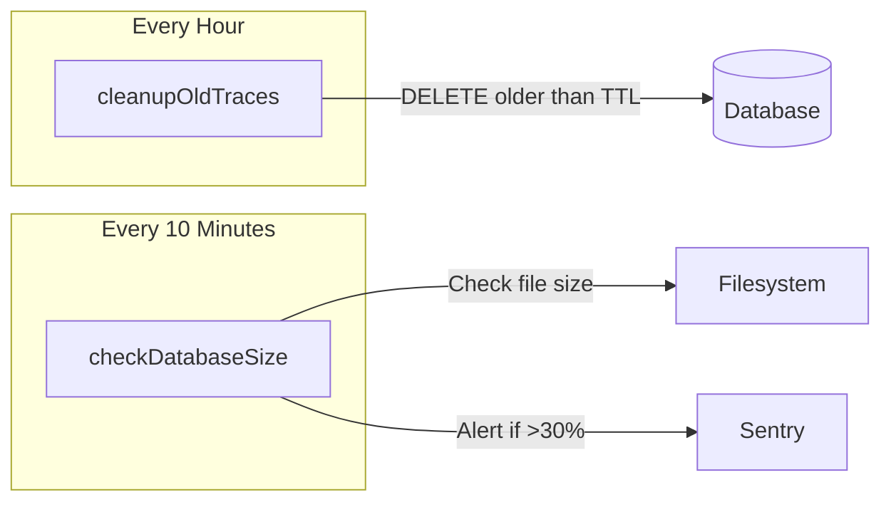

# Traces (Request Observability) Feature Architecture

## Overview

The Traces feature provides request-level observability for the application, capturing timing, status codes, and metadata for every API request. It includes real-time streaming, historical queries, and automated maintenance.

**Route:** `/status/traces`

## Purpose

This feature serves multiple purposes:

1. **Debugging**: Quickly identify slow or failing requests in production
2. **Performance Analysis**: Understand request timing breakdown (handler, interceptor phases)
3. **Technical Demonstration**: Showcase global interceptors, event-driven architecture, SSE streaming, and scheduled tasks

## Architecture Diagram



## Data Flow

### 1. Request Tracing (Interceptor)

Every API request (except excluded paths) is captured by `TracingInterceptor`:

```
Request → TracingInterceptor → Handler → Response
              ↓
         Generate traceId
         Start timer
              ↓
         Record on complete
              ↓
         TraceService.recordTrace()
```

**Excluded Paths:**

- `/api/health` - Health checks would flood traces
- `/api/traces/stream` - Avoids recursive tracing

### 2. Trace Storage (Service → Repository)

```typescript
// TraceService emits event after persisting
const trace = await this.repository.create(input);
this.eventEmitter.emit('trace.created', trace);
```

### 3. Real-Time Streaming (SSE)



### 4. Historical Queries (REST API)

- `GET /api/traces` - List with filters
- `GET /api/traces/:traceId` - Single trace detail
- `GET /api/traces/stats` - Aggregated statistics

### 5. Maintenance (Scheduled Tasks)



## File Structure

```
src/server/modules/traces/
├── trace.module.ts           # Module definition
├── trace.controller.ts       # REST + SSE endpoints
├── trace.service.ts          # Business logic + scheduled tasks
├── trace.repository.ts       # Data access layer
├── trace.entity.ts           # TypeORM entity
├── trace.types.ts            # Interface definitions
├── tokens.ts                 # DI tokens
├── trace.service.test.ts     # Unit tests (hybrid approach)
└── trace.integration.test.ts # Integration tests

src/server/shared/interceptors/
├── tracing.interceptor.ts    # Global request interceptor
└── tracing.interceptor.test.ts

src/ui/containers/status/traces/
├── traces.container.tsx      # List view
├── trace-detail.container.tsx# Detail view
├── traces.container.test.tsx # Integration tests
├── components/
│   ├── TraceFilters.tsx      # Filter controls
│   ├── TraceRow.tsx          # List item
│   ├── TimingWaterfall.tsx   # Timing breakdown visualization
│   └── *.module.scss
└── hooks/
    └── useTraces.ts          # TanStack Query hooks + SSE

src/shared/types/
└── traces.ts                 # Shared type definitions
```

## API Reference

### List Traces

```
GET /api/traces
```

**Query Parameters:**

| Parameter     | Type   | Description                    |
| ------------- | ------ | ------------------------------ |
| `method`      | string | Filter by HTTP method          |
| `path`        | string | Filter by path (partial match) |
| `statusCode`  | number | Filter by exact status code    |
| `minDuration` | number | Minimum duration in ms         |
| `maxDuration` | number | Maximum duration in ms         |
| `limit`       | number | Max results (default 50)       |
| `offset`      | number | Pagination offset              |

**Response:**

```json
[
  {
    "traceId": "550e8400-e29b-41d4-a716-446655440000",
    "method": "GET",
    "path": "/api/blog",
    "statusCode": 200,
    "durationMs": 45.23,
    "timing": {
      "middleware": 0,
      "guard": 0,
      "interceptorPre": 2.1,
      "handler": 42.5,
      "interceptorPost": 0.63
    },
    "userId": 1,
    "userAgent": "Mozilla/5.0...",
    "ip": "127.0.0.1",
    "timestamp": "2026-01-24T12:00:00.000Z"
  }
]
```

### Get Trace Statistics

```
GET /api/traces/stats
```

**Response:**

```json
{
  "totalCount": 1523,
  "avgDuration": 42.5,
  "errorRate": 2.3
}
```

### Stream Traces (SSE)

```
GET /api/traces/stream
```

**Event Format:**

```
event: message
data: {"traceId":"...","method":"GET",...}
```

### Delete Trace (Admin)

```
DELETE /api/traces/:traceId
Authorization: Bearer <jwt>
```

## Key Dependencies

- **Backend:**
  - `@nestjs/event-emitter` - Event-driven communication
  - `@nestjs/schedule` - Cron jobs for maintenance
  - `@sentry/node` - Capacity alerting
  - TypeORM - Database access

- **Frontend:**
  - `@tanstack/react-query` - Data fetching and caching
  - EventSource API - SSE streaming
  - recharts (potential) - Timing visualization

## Configuration

| Environment Variable | Default  | Description                   |
| -------------------- | -------- | ----------------------------- |
| `TRACE_TTL_MS`       | 86400000 | Retention period (24 hours)   |
| `MAX_DB_SIZE_MB`     | 100      | Database size alert threshold |

## Testing Strategy

### Backend

- **Unit tests** (`trace.service.test.ts`): Test scheduled tasks and business logic with mocked dependencies
- **Integration tests** (`trace.integration.test.ts`): Test full request flow through controller

### Frontend

- **Container tests** (`traces.container.test.tsx`): Mock axios and EventSource, test all user interactions

## Related Documentation

- [ADR-010: Request Tracing & Observability](../decisions/ADR-010-request-tracing-observability.md)
- [ADR-011: Event-Driven Architecture](../decisions/ADR-011-event-driven-architecture.md)
- [ADR-012: Scheduled Tasks](../decisions/ADR-012-scheduled-tasks-and-maintenance.md)
- [Component: Status](status.md) - Parent feature
