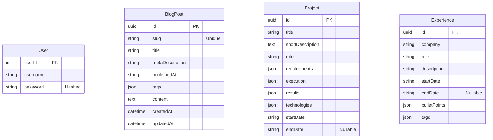

# Database Schema

This document outlines the database schema used in the application. It is visualized using Mermaid entity-relationship diagrams.

## Overview

- **Database:** SQLite
- **ORM:** TypeORM
- **Entities:**
  - `User`: Authentication credentials.
  - `BlogPost`: Blog content and metadata.
  - `Project`: Portfolio project details.
  - `Experience`: Professional work history.

## Entity Relationship Diagram

## Entity Details

### User
Manages authentication credentials.
- **PK**: `userId` (Auto-increment integer)
- `username`: Unique identifier.

### BlogPost
Content for the technical blog.
- **PK**: `id` (UUID)
- `slug`: Human-readable identifier for URLs (e.g., `/blog/my-post`).
- `content`: Markdown text of the post.

### Project
Displays technical projects in the portfolio.
- **PK**: `id` (UUID)
- `execution`, `results`, `requirements`: JSON arrays storing bullet points for the UI.

### Experience
Represents professional career timeline.
- **PK**: `id` (UUID)
- `bulletPoints`: Key achievements or responsibilities as a JSON array.
