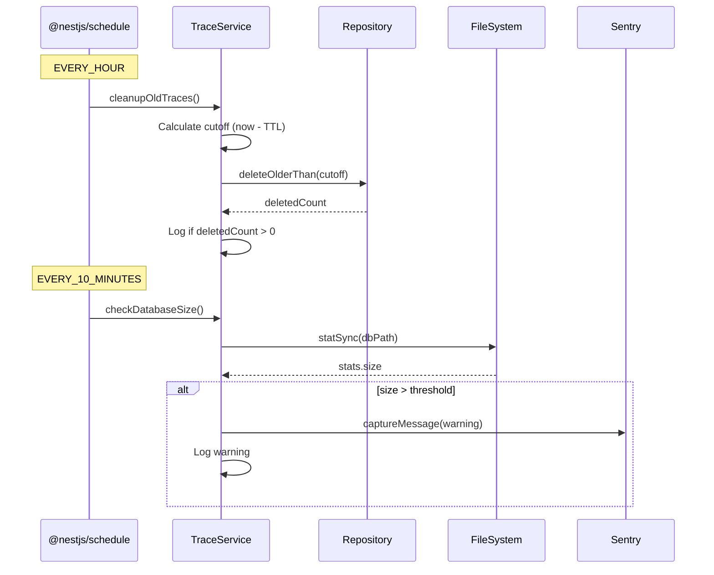

# ADR-012: Scheduled Tasks and Database Maintenance

## Status

Accepted - January 24, 2026

## Context

The Request Tracing feature (ADR-010) stores traces in SQLite. Without cleanup,
the database would grow unbounded, eventually exceeding Heroku's ephemeral storage
limits (~500MB for slug size).

Additionally, running on Heroku's free/hobby tier means:

- No external monitoring services available
- Limited visibility into database growth
- Need for proactive capacity management

### Requirements

1. **Automatic cleanup**: Remove traces older than a configurable TTL
2. **Capacity monitoring**: Alert before database fills up
3. **Non-blocking**: Maintenance must not impact request handling
4. **Observable**: Logging and metrics for operations

## Decision

We will use **@nestjs/schedule** for cron-based maintenance tasks, with Sentry
integration for capacity alerts.

### Cleanup Task

Traces older than 24 hours (configurable via `TRACE_TTL_MS`) are deleted hourly:

```typescript
@Cron(CronExpression.EVERY_HOUR)
async cleanupOldTraces(): Promise<number> {
  const cutoffDate = new Date(Date.now() - this.ttlMs);
  const deletedCount = await this.repository.deleteOlderThan(cutoffDate);

  if (deletedCount > 0) {
    this.logger.log(`Cleaned up ${deletedCount} traces older than ${cutoffDate}`);
  }

  return deletedCount;
}
```

### Capacity Monitor

Database size is checked every 10 minutes. If usage exceeds 30% of the configured
maximum (100MB default), a Sentry alert is triggered:

```typescript
@Cron(CronExpression.EVERY_10_MINUTES)
async checkDatabaseSize(): Promise<void> {
  const stats = fs.statSync(dbPath);
  const usageRatio = stats.size / MAX_DB_SIZE_BYTES;

  if (usageRatio >= DB_SIZE_ALERT_THRESHOLD) {
    Sentry.captureMessage(`Database size alert: ${usageRatio}% capacity`, {
      level: 'warning',
      tags: { component: 'TraceService', alert: 'database-capacity' },
    });
  }
}
```

### Configuration

| Environment Variable | Default  | Description                    |
| -------------------- | -------- | ------------------------------ |
| `TRACE_TTL_MS`       | 86400000 | Trace retention period (24h)   |
| `MAX_DB_SIZE_MB`     | 100      | Maximum expected database size |

## Consequences

### Positive

- **Bounded storage**: Database size is predictable and controlled
- **Early warning**: Sentry alerts before capacity issues become critical
- **Configurable**: TTL and thresholds adjustable per environment
- **Demonstrates patterns**: Showcases NestJS scheduling capabilities

### Negative

- **Fixed intervals**: Cron doesn't adapt to load (consider dynamic scheduling)
- **Single-dyno only**: `@nestjs/schedule` runs in-process (multiple dynos = duplicate runs)
- **Ephemeral storage**: Heroku dyno restarts reset the database anyway

## Testing Approach

Scheduled tasks are difficult to test at the integration layer because:

1. They run on timers, not on-demand
2. They have side effects (database deletes, Sentry alerts)
3. They interact with the filesystem

### Hybrid Testing Strategy

1. **Unit tests** with mocked dependencies verify business logic:

   ```typescript
   it('should delete traces older than cutoff', async () => {
     mockRepository.deleteOlderThan.mockResolvedValue(5);

     const result = await service.cleanupOldTraces();

     expect(result).toBe(5);
     expect(mockRepository.deleteOlderThan).toHaveBeenCalledWith(
       expect.any(Date),
     );
   });
   ```

2. **Integration tests** verify repository operations work with real database

3. **Manual testing** by temporarily reducing intervals in development

## Execution Flow Diagram



## Related Documentation

- [ADR-010: Request Tracing](ADR-010-request-tracing-observability.md)
- [Component: Traces](../components/traces.md)
