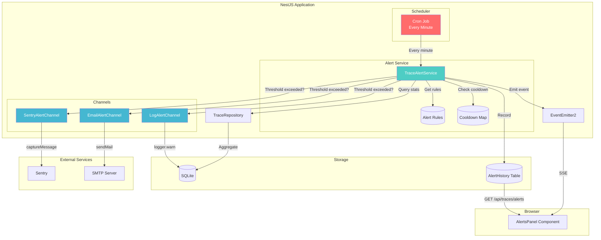
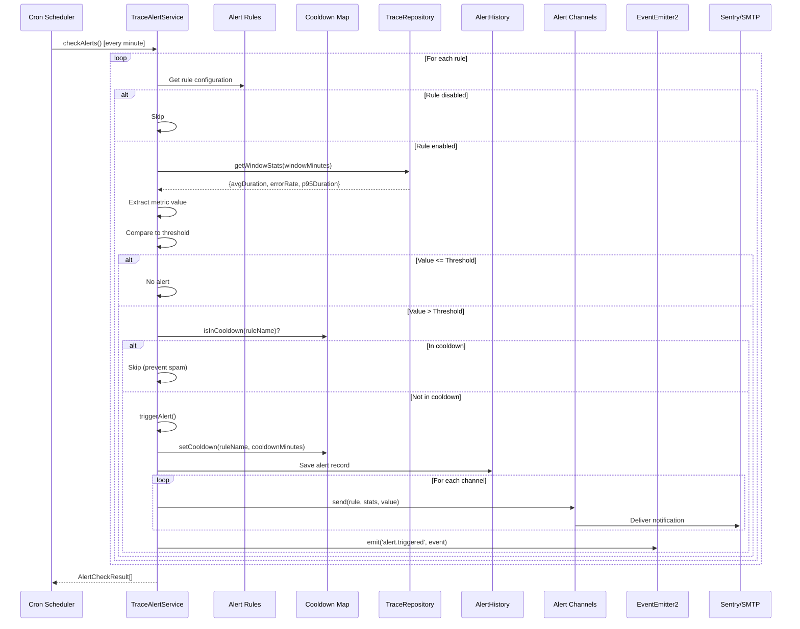

# Alerting Architecture

## Overview

The alerting system monitors trace metrics and sends notifications when thresholds are exceeded. It uses a cron-based evaluation loop with configurable rules, cooldown periods, and multi-channel delivery.

**ADR Reference:** [ADR-010: Request Tracing Observability](../../decisions/ADR-010-request-tracing-observability.md)

---

## Architecture Diagram



---

## Alert Flow

### Sequence Diagram



---

## Components

### TraceAlertService

**File:** `src/server/modules/traces/trace-alert.service.ts`

Core alert orchestration service:

| Method                       | Description                               |
| ---------------------------- | ----------------------------------------- |
| `checkAlerts()`              | Cron job entry point, evaluates all rules |
| `evaluateRule(rule)`         | Check single rule against current metrics |
| `triggerAlert(rule, value)`  | Record and dispatch alert                 |
| `getWindowStats(minutes)`    | Aggregate metrics for time window         |
| `setCooldown(name, minutes)` | Prevent re-alerting                       |
| `isInCooldown(name)`         | Check cooldown status                     |
| `resolveAlert(id, notes?)`   | Mark alert as resolved                    |
| `getUnresolvedAlerts()`      | Fetch active alerts for dashboard         |

**Scheduled Tasks:**

| Cron Expression | Method          | Purpose                  |
| --------------- | --------------- | ------------------------ |
| `EVERY_MINUTE`  | `checkAlerts()` | Evaluate all alert rules |

### IAlertChannel Interface

**File:** `src/server/modules/traces/channels/alert-channel.interface.ts`

Contract for alert channel implementations:

```typescript
interface IAlertChannel {
  readonly channelId: string;

  send(
    rule: AlertRule,
    stats: TraceStatsResult,
    actualValue: number,
  ): Promise<void>;

  isEnabled(): boolean;
}
```

### Channel Implementations

#### SentryAlertChannel

**File:** `src/server/modules/traces/channels/sentry-alert.channel.ts`

Sends alerts as Sentry events with appropriate severity levels.

| Metric Value vs Threshold | Severity  |
| ------------------------- | --------- |
| < 2x threshold            | `warning` |
| < 5x threshold            | `error`   |
| >= 5x threshold           | `fatal`   |

**Configuration:** Enabled when `SENTRY_DSN` is set.

#### EmailAlertChannel

**File:** `src/server/modules/traces/channels/email-alert.channel.ts`

Sends HTML-formatted email alerts via SMTP.

**Email Format:**

- Red header with alert name
- Current value vs threshold
- System context (total requests, average latency)
- Timestamp

**Configuration:** Requires all SMTP environment variables.

#### LogAlertChannel

**File:** `src/server/modules/traces/channels/log-alert.channel.ts`

Logs alerts to application output (always enabled).

**Format:**

```
[LogAlertChannel] ALERT: High Latency - avgDuration: 750.00ms (threshold: 500)
```

### AlertHistory Entity

**File:** `src/server/modules/traces/alert-history.entity.ts`

Persists alert records for audit trail:

| Column        | Type         | Description                 |
| ------------- | ------------ | --------------------------- |
| `id`          | INTEGER (PK) | Auto-increment ID           |
| `ruleName`    | TEXT         | Name of the alert rule      |
| `metric`      | TEXT         | Metric that triggered alert |
| `threshold`   | REAL         | Configured threshold        |
| `actualValue` | REAL         | Value when triggered        |
| `channels`    | TEXT (JSON)  | Channels notified           |
| `triggeredAt` | DATETIME     | When alert fired            |
| `resolved`    | BOOLEAN      | Resolution status           |
| `resolvedAt`  | DATETIME     | When resolved (nullable)    |
| `resolvedBy`  | TEXT         | Who resolved (nullable)     |
| `notes`       | TEXT         | Resolution notes (nullable) |

---

## Alert Rules

### Configuration Structure

```typescript
interface AlertRule {
  name: string; // Human-readable name
  metric: 'avgDuration' | 'errorRate' | 'p95Duration';
  threshold: number; // Trigger value
  windowMinutes: number; // Evaluation time window
  cooldownMinutes: number; // Minimum time between alerts
  channels: AlertChannel[]; // Delivery channels
  enabled: boolean; // Active status
}
```

### Default Rules

| Rule              | Metric      | Threshold | Window | Cooldown | Channels    |
| ----------------- | ----------- | --------- | ------ | -------- | ----------- |
| High Latency      | avgDuration | 500ms     | 5 min  | 30 min   | sentry, log |
| High Error Rate   | errorRate   | 5%        | 5 min  | 30 min   | sentry, log |
| P95 Latency Spike | p95Duration | 1000ms    | 5 min  | 60 min   | sentry, log |

---

## API Endpoints

### GET /api/traces/alerts/unresolved

Returns all unresolved alerts.

**Response:**

```typescript
interface AlertHistoryRecord {
  id: number;
  ruleName: string;
  metric: string;
  threshold: number;
  actualValue: number;
  triggeredAt: string; // ISO timestamp
  resolved: boolean; // Always false for this endpoint
  resolvedAt?: string;
  resolvedBy?: string;
  notes?: string;
}
```

### POST /api/traces/alerts/:id/resolve

Marks an alert as resolved.

**Request Body (optional):**

```typescript
{
  notes?: string;      // Resolution notes
  resolvedBy?: string; // Who resolved (defaults to authenticated user)
}
```

**Response:** Updated `AlertHistoryRecord`

---

## How to Extend

### Adding a New Alert Channel

1. **Create the channel class:**

```typescript
// src/server/modules/traces/channels/slack-alert.channel.ts
import { Injectable, Inject } from '@nestjs/common';
import { ConfigService } from '@nestjs/config';
import type { IAlertChannel } from './alert-channel.interface';
import type { AlertRule, TraceStatsResult } from '../trace-alert.types';
import { LoggerService, LOGGER_TOKENS } from 'server/shared/adapters/logger';

@Injectable()
export class SlackAlertChannel implements IAlertChannel {
  readonly channelId = 'slack';

  constructor(
    @Inject(LOGGER_TOKENS.LoggerService)
    private readonly logger: LoggerService,
    private readonly configService: ConfigService,
  ) {}

  isEnabled(): boolean {
    return !!this.configService.get('SLACK_WEBHOOK_URL');
  }

  async send(
    rule: AlertRule,
    stats: TraceStatsResult,
    actualValue: number,
  ): Promise<void> {
    if (!this.isEnabled()) {
      this.logger.warn('SlackAlertChannel: No webhook configured');
      return;
    }

    const webhookUrl = this.configService.get<string>('SLACK_WEBHOOK_URL')!;

    await fetch(webhookUrl, {
      method: 'POST',
      headers: { 'Content-Type': 'application/json' },
      body: JSON.stringify({
        text: `🚨 *Alert: ${rule.name}*\n${rule.metric}: ${actualValue.toFixed(2)} (threshold: ${rule.threshold})`,
      }),
    });

    this.logger.log(`SlackAlertChannel: Sent alert for "${rule.name}"`);
  }
}
```

2. **Export from barrel:**

```typescript
// src/server/modules/traces/channels/index.ts
export { SlackAlertChannel } from './slack-alert.channel';
```

3. **Register in TraceAlertService:**

```typescript
// Constructor
constructor(
  // ... existing params
  slackChannel: SlackAlertChannel,
) {
  // ... existing setup
  this.#channels.set('slack', slackChannel);
}
```

4. **Add to module providers:**

```typescript
// src/server/modules/traces/trace.module.ts
providers: [
  // ... existing providers
  SlackAlertChannel,
];
```

5. **Add channel to rules:**

```typescript
// src/server/modules/traces/alert.config.ts
channels: ['sentry', 'log', 'slack'],
```

6. **Add environment variable to configuration.md**

7. **Add tests**

### Adding a New Alert Rule

1. **Add to `defaultAlertRules`:**

```typescript
// src/server/modules/traces/alert.config.ts
{
  name: 'Request Volume Spike',
  metric: 'requestCount',  // You may need to add this metric type
  threshold: 1000,         // More than 1000 requests per window
  windowMinutes: 5,
  cooldownMinutes: 15,
  channels: ['log'],
  enabled: true,
}
```

2. **If adding a new metric, update:**
   - `AlertRule.metric` type in `alert.config.ts`
   - `getMetricValue()` method in `TraceAlertService`
   - `WindowStats` type if needed

### Disabling Alerts

Set `enabled: false` in the rule configuration, or remove from `channels` array.

---

## Testing Patterns

### Unit Testing Alert Service (Manual DI)

```typescript
describe('TraceAlertService', () => {
  let service: TraceAlertService;
  let mockRepository: jest.Mocked<ITraceRepository>;
  let mockAlertHistoryRepo: jest.Mocked<Repository<AlertHistory>>;
  let mockEventEmitter: jest.Mocked<EventEmitter2>;
  let mockSentryChannel: jest.Mocked<IAlertChannel>;
  let mockLogChannel: jest.Mocked<IAlertChannel>;
  let mockEmailChannel: jest.Mocked<IAlertChannel>;
  let mockLogger: jest.Mocked<LoggerService>;

  beforeEach(() => {
    mockRepository = {
      getStats: jest.fn(),
      getHourlyStats: jest.fn(),
    } as unknown as jest.Mocked<ITraceRepository>;

    mockAlertHistoryRepo = {
      create: jest.fn(),
      save: jest.fn(),
      find: jest.fn(),
      findOneBy: jest.fn(),
    } as unknown as jest.Mocked<Repository<AlertHistory>>;

    mockEventEmitter = {
      emit: jest.fn(),
    } as unknown as jest.Mocked<EventEmitter2>;

    mockSentryChannel = {
      channelId: 'sentry',
      isEnabled: jest.fn().mockReturnValue(true),
      send: jest.fn(),
    };

    mockLogChannel = {
      channelId: 'log',
      isEnabled: jest.fn().mockReturnValue(true),
      send: jest.fn(),
    };

    mockEmailChannel = {
      channelId: 'email',
      isEnabled: jest.fn().mockReturnValue(false), // Disabled by default
      send: jest.fn(),
    };

    mockLogger = {
      log: jest.fn(),
      warn: jest.fn(),
      error: jest.fn(),
    } as unknown as jest.Mocked<LoggerService>;

    service = new TraceAlertService(
      mockRepository,
      mockAlertHistoryRepo,
      mockLogger,
      mockEventEmitter,
      mockSentryChannel as unknown as SentryAlertChannel,
      mockLogChannel as unknown as LogAlertChannel,
      mockEmailChannel as unknown as EmailAlertChannel,
    );
  });

  describe('checkAlerts', () => {
    it('should trigger alert when threshold exceeded', async () => {
      mockRepository.getHourlyStats.mockResolvedValue([
        {
          hour: '2025-01-25T10:00:00Z',
          count: 100,
          avgDuration: 600,
          errorRate: 1,
          p95Duration: 800,
        },
      ]);
      mockRepository.getStats.mockResolvedValue({
        totalCount: 100,
        avgDuration: 600,
        errorRate: 1,
        successCount: 99,
        errorCount: 1,
      });
      mockAlertHistoryRepo.create.mockReturnValue({ id: 1 } as AlertHistory);
      mockAlertHistoryRepo.save.mockResolvedValue({ id: 1 } as AlertHistory);

      const results = await service.checkAlerts();

      const highLatencyResult = results.find(
        (r) => r.ruleName === 'High Latency',
      );
      expect(highLatencyResult?.triggered).toBe(true);
      expect(mockSentryChannel.send).toHaveBeenCalled();
      expect(mockLogChannel.send).toHaveBeenCalled();
      expect(mockEmailChannel.send).not.toHaveBeenCalled(); // Disabled
    });

    it('should respect cooldown period', async () => {
      // First call triggers
      mockRepository.getHourlyStats.mockResolvedValue([
        {
          hour: '2025-01-25T10:00:00Z',
          count: 100,
          avgDuration: 600,
          errorRate: 1,
          p95Duration: 800,
        },
      ]);
      mockRepository.getStats.mockResolvedValue({
        totalCount: 100,
        avgDuration: 600,
        errorRate: 1,
        successCount: 99,
        errorCount: 1,
      });
      mockAlertHistoryRepo.create.mockReturnValue({ id: 1 } as AlertHistory);
      mockAlertHistoryRepo.save.mockResolvedValue({ id: 1 } as AlertHistory);

      await service.checkAlerts();
      expect(mockSentryChannel.send).toHaveBeenCalledTimes(1);

      // Second call within cooldown should not trigger
      await service.checkAlerts();
      expect(mockSentryChannel.send).toHaveBeenCalledTimes(1); // Still 1
    });
  });
});
```

### Testing Cron Jobs

To test cron behavior without waiting, call the method directly:

```typescript
it('should run checkAlerts on schedule', async () => {
  const spy = jest.spyOn(service, 'checkAlerts');

  // Call directly (don't wait for cron)
  await service.checkAlerts();

  expect(spy).toHaveBeenCalled();
});
```

For integration testing with real timing (not recommended for unit tests):

```typescript
// Use Jest fake timers
jest.useFakeTimers();

// Advance time
jest.advanceTimersByTime(60000); // 1 minute

jest.useRealTimers();
```

---

## Cooldown Mechanism

The cooldown prevents alert spam by enforcing a minimum time between alerts for the same rule.

### How It Works

1. **On Alert Trigger:** `setCooldown(ruleName, cooldownMinutes)` stores the expiry time
2. **On Next Check:** `isInCooldown(ruleName)` returns `true` if not yet expired
3. **Cooldown Expiry:** Alert can trigger again after cooldown period

### Cooldown Storage

Currently uses in-memory `Map<string, Date>`. For multi-instance deployments, consider:

- Redis-based cooldown storage
- Database-backed cooldown table

---

## Events

### alert.triggered

Emitted when an alert fires:

```typescript
interface AlertEvent {
  rule: AlertRule;
  currentValue: number;
  triggeredAt: Date;
  context: {
    windowMinutes: number;
    totalRequests: number;
  };
}
```

**Consumers:**

- SSE endpoint for real-time dashboard updates
- Future: Audit logging, metrics collection

---

## Future Enhancements

1. **Slack/Discord Webhooks** - Additional channel implementations
2. **PagerDuty Integration** - On-call escalation
3. **Dynamic Rules** - Admin API for runtime rule configuration
4. **Alert Grouping** - Correlate related alerts
5. **Scheduled Maintenance Windows** - Suppress alerts during maintenance
6. **Trend-Based Alerts** - Alert on rate of change, not just absolute values
