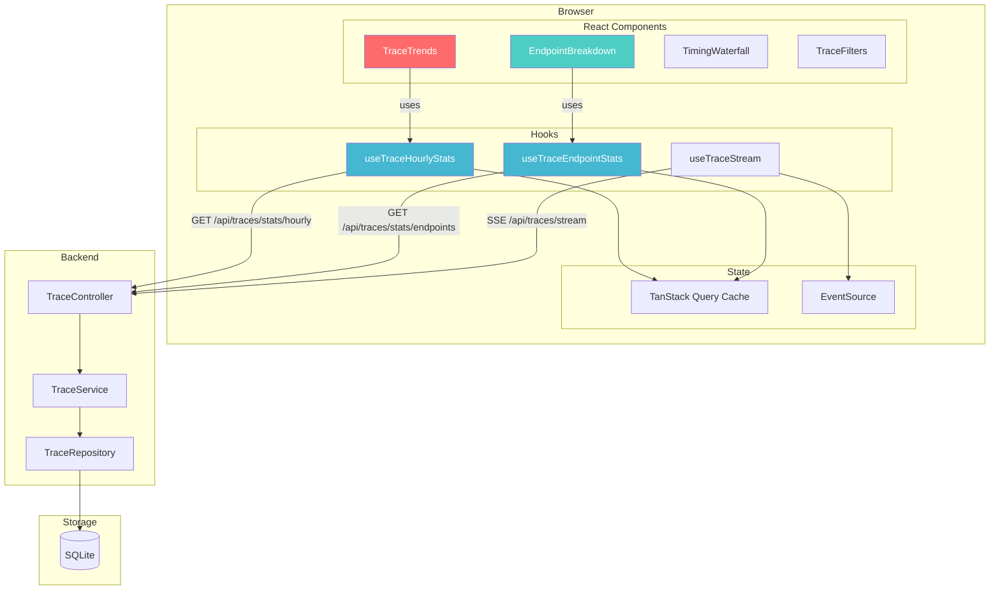

# Visualization Architecture

## Overview

The visualization system provides interactive charts and breakdowns for understanding API performance. It uses Recharts for charting, TanStack Query for data fetching, and Server-Sent Events (SSE) for real-time updates.

**ADR Reference:** [ADR-006: Recharts for Telemetry Visualization](../../decisions/ADR-006-recharts-for-telemetry-visualization.md)

---

## Architecture Diagram



---

## Components

### TraceTrends

**File:** `src/ui/containers/status/traces/components/TraceTrends.tsx`

Line chart showing request metrics over time using Recharts.

**Props:**

| Prop    | Type   | Default | Description          |
| ------- | ------ | ------- | -------------------- |
| `hours` | number | 24      | Time window in hours |

**Data Visualized:**

| Metric        | Y-Axis | Color  | Description                  |
| ------------- | ------ | ------ | ---------------------------- |
| `avgDuration` | Left   | Purple | Average response time (ms)   |
| `p95Duration` | Left   | Blue   | 95th percentile latency (ms) |
| `errorRate`   | Right  | Orange | Error percentage (%)         |

**Recharts Components Used:**

- `ResponsiveContainer` - Responsive sizing
- `LineChart` - Main chart
- `Line` (x3) - One per metric
- `XAxis` - Time labels (formatted hour)
- `YAxis` (x2) - Dual axis for latency/error rate
- `Tooltip` - Hover details
- `Legend` - Metric labels

### EndpointBreakdown

**File:** `src/ui/containers/status/traces/components/EndpointBreakdown.tsx`

Table showing per-endpoint performance metrics.

**Props:**

| Prop    | Type   | Default | Description           |
| ------- | ------ | ------- | --------------------- |
| `limit` | number | 10      | Max endpoints to show |

**Columns:**

| Column      | Source                 | Styling                  |
| ----------- | ---------------------- | ------------------------ |
| Method      | `endpoint.method`      | Color-coded by HTTP verb |
| Path        | `endpoint.path`        | Monospace font           |
| Requests    | `endpoint.count`       | Relative bar width       |
| Avg Latency | `endpoint.avgDuration` | Red if > 500ms           |
| Errors      | `endpoint.errorRate`   | Red if > 5%              |

### TimingWaterfall

**File:** `src/ui/containers/status/traces/components/TimingWaterfall.tsx`

Horizontal bar showing request phase breakdown.

**Props:**

| Prop            | Type        | Default  | Description                      |
| --------------- | ----------- | -------- | -------------------------------- |
| `timing`        | PhaseTiming | required | Phase timing data                |
| `totalDuration` | number      | required | Total request time (ms)          |
| `expanded`      | boolean     | false    | Show detailed view with tooltips |

**Phases Displayed:**

| Phase            | Color  | Description              |
| ---------------- | ------ | ------------------------ |
| Pre-Interceptor  | Blue   | Auth, validation, guards |
| Handler          | Green  | Business logic           |
| Post-Interceptor | Purple | Response transformation  |

**Expanded Mode Features:**

- Hover tooltips with exact timing
- Percentage labels for phases > 10%
- Slow phase highlighting (> 100ms shown in red)

### TraceFilters

**File:** `src/ui/containers/status/traces/components/TraceFilters.tsx`

Filter controls for trace list and visualizations.

**Filter Fields:**

| Field        | Type   | Description                 |
| ------------ | ------ | --------------------------- |
| Method       | Select | Filter by HTTP method       |
| Path         | Text   | Filter by path substring    |
| Status       | Select | Filter by status code range |
| Min Duration | Number | Minimum response time       |
| Max Duration | Number | Maximum response time       |

**Quick Presets:**

- "Slow Requests" - Duration > 500ms
- "Errors Only" - Status >= 400
- "Last Hour" - Time range filter

---

## Hooks

### useTraceHourlyStats

**File:** `src/ui/containers/status/traces/hooks/useTraces.ts`

Fetches aggregated hourly statistics.

```typescript
export function useTraceHourlyStats(hours: number = 24) {
  return useQuery({
    queryKey: ['traceHourlyStats', hours],
    queryFn: async () => {
      const response = await axios.get<TraceHourlyStats[]>(
        `/api/traces/stats/hourly?hours=${hours}`,
      );
      return response.data;
    },
    staleTime: 60000, // 1 minute - data doesn't change rapidly
  });
}
```

**Returns:** `UseQueryResult<TraceHourlyStats[]>`

### useTraceEndpointStats

**File:** `src/ui/containers/status/traces/hooks/useTraces.ts`

Fetches per-endpoint metrics.

```typescript
export function useTraceEndpointStats(limit: number = 20) {
  return useQuery({
    queryKey: ['traceEndpointStats', limit],
    queryFn: async () => {
      const response = await axios.get<TraceEndpointStats[]>(
        `/api/traces/stats/endpoints?limit=${limit}`,
      );
      return response.data;
    },
    staleTime: 60000, // 1 minute
  });
}
```

**Returns:** `UseQueryResult<TraceEndpointStats[]>`

### useTraceStream (SSE)

**File:** `src/ui/containers/status/traces/hooks/useTraces.ts`

Subscribes to real-time trace events via Server-Sent Events.

```typescript
interface UseTraceStreamResult {
  traces: RequestTrace[]; // Live traces buffer
  connectionState: ConnectionState; // 'connecting' | 'connected' | 'disconnected' | 'error'
  clearTraces: () => void; // Clear buffer
  reconnect: () => void; // Force reconnection
}

export function useTraceStream(
  maxTraces: number = 100,
  enabled: boolean = true,
): UseTraceStreamResult;
```

**Implementation Details:**

- Uses browser `EventSource` API
- Maintains sliding window buffer (default 100 traces)
- Auto-reconnects on disconnect
- Cleans up on unmount

---

## API Endpoints

### GET /api/traces/stats/hourly

Returns hourly aggregated statistics.

**Query Parameters:**

| Param   | Type   | Default | Description      |
| ------- | ------ | ------- | ---------------- |
| `hours` | number | 24      | Hours of history |

**Response:**

```typescript
interface TraceHourlyStats {
  hour: string; // ISO timestamp (start of hour)
  count: number; // Total requests
  avgDuration: number; // Average response time (ms)
  errorRate: number; // Error percentage (0-100)
  p95Duration: number; // 95th percentile latency (ms)
}
```

### GET /api/traces/stats/endpoints

Returns per-endpoint aggregated statistics.

**Query Parameters:**

| Param   | Type   | Default | Description             |
| ------- | ------ | ------- | ----------------------- |
| `limit` | number | 20      | Max endpoints to return |

**Response:**

```typescript
interface TraceEndpointStats {
  method: string; // HTTP method
  path: string; // Normalized path
  count: number; // Total requests
  avgDuration: number; // Average response time (ms)
  errorRate: number; // Error percentage (0-100)
}
```

### GET /api/traces/stream (SSE)

Server-Sent Events endpoint for real-time traces.

**Event Format:**

```
event: message
data: {"traceId":"abc123","method":"GET","path":"/api/blog","statusCode":200,...}
```

---

## How to Extend

### Adding a New Chart

1. **Create the component** in `src/ui/containers/status/traces/components/`:

```tsx
// MyNewChart.tsx
import { ResponsiveContainer, BarChart, Bar, XAxis, YAxis } from 'recharts';
import { Card, CardHeader, CardTitle, CardContent } from 'ui/shared/components';
import { useMyNewData } from '../hooks/useTraces';
import styles from './MyNewChart.module.scss';

export function MyNewChart(): React.ReactNode {
  const { data, isLoading, error } = useMyNewData();

  if (isLoading) return <div>Loading...</div>;
  if (error) return <div>Error loading data</div>;

  return (
    <Card className={styles.container}>
      <CardHeader>
        <CardTitle>My New Chart</CardTitle>
      </CardHeader>
      <CardContent>
        <ResponsiveContainer width="100%" height={200}>
          <BarChart data={data}>
            <XAxis dataKey="name" />
            <YAxis />
            <Bar dataKey="value" fill="#8884d8" />
          </BarChart>
        </ResponsiveContainer>
      </CardContent>
    </Card>
  );
}
```

2. **Create the hook** in `useTraces.ts`:

```typescript
export function useMyNewData() {
  return useQuery({
    queryKey: ['myNewData'],
    queryFn: async () => {
      const response = await axios.get<MyDataType[]>('/api/traces/my-endpoint');
      return response.data;
    },
    staleTime: 60000,
  });
}
```

3. **Add the backend endpoint** in `trace.controller.ts`:

```typescript
@Get('my-endpoint')
async getMyData(): Promise<MyDataType[]> {
  return this.traceService.getMyData();
}
```

4. **Export from barrel** in `components/index.ts`

5. **Add to container** in `traces.container.tsx`

6. **Add tests** (see Testing Patterns below)

### Adding a New Filter

1. **Update `TraceFilters` type** in `shared/types/trace.types.ts`:

```typescript
export interface TraceFilters {
  // ... existing filters
  myNewFilter?: string;
}
```

2. **Add UI control** in `TraceFilters.tsx`

3. **Handle in `useTraces` hook** - add to query params

4. **Handle in backend** - add to controller/repository query

---

## Testing Patterns

### Testing Recharts Components

Recharts uses SVG rendering which requires special mocking:

```typescript
// Mock Recharts to avoid SVG rendering issues in Jest
jest.mock('recharts', () => {
  const OriginalModule = jest.requireActual('recharts');
  return {
    ...OriginalModule,
    ResponsiveContainer: ({ children }: { children: React.ReactNode }) => (
      <div data-testid="responsive-container" style={{ width: 800, height: 400 }}>
        {children}
      </div>
    ),
  };
});
```

**Full Test Example:**

```typescript
describe('TraceTrends', () => {
  it('renders loading state', () => {
    mockUseTraceHourlyStats.mockReturnValue({
      data: undefined,
      isLoading: true,
      error: null,
    });

    render(<TraceTrends />);
    expect(screen.getByText('Loading trends...')).toBeInTheDocument();
  });

  it('renders chart with data', () => {
    mockUseTraceHourlyStats.mockReturnValue({
      data: [
        { hour: '2025-01-25T10:00:00Z', count: 100, avgDuration: 50, errorRate: 1, p95Duration: 100 },
      ],
      isLoading: false,
      error: null,
    });

    render(<TraceTrends />);
    expect(screen.getByTestId('responsive-container')).toBeInTheDocument();
  });
});
```

### Testing SSE Streams

Create a mock EventSource:

```typescript
// src/ui/test-utils/mockEventSource.ts
export class MockEventSource {
  static instances: MockEventSource[] = [];

  onopen: (() => void) | null = null;
  onmessage: ((event: { data: string }) => void) | null = null;
  onerror: (() => void) | null = null;

  constructor(public url: string) {
    MockEventSource.instances.push(this);
  }

  close() {
    // Cleanup
  }

  // Test helper: simulate receiving a message
  simulateMessage(data: unknown) {
    this.onmessage?.({ data: JSON.stringify(data) });
  }

  // Test helper: simulate connection open
  simulateOpen() {
    this.onopen?.();
  }

  static reset() {
    MockEventSource.instances = [];
  }
}

// In test file:
beforeEach(() => {
  MockEventSource.reset();
  global.EventSource = MockEventSource as unknown as typeof EventSource;
});
```

**Full SSE Test Example:**

```typescript
describe('useTraceStream', () => {
  it('receives live traces', async () => {
    const { result } = renderHook(() => useTraceStream());

    // Wait for connection
    await waitFor(() => {
      expect(result.current.connectionState).toBe('connecting');
    });

    // Simulate connection open
    act(() => {
      MockEventSource.instances[0].simulateOpen();
    });

    expect(result.current.connectionState).toBe('connected');

    // Simulate receiving a trace
    act(() => {
      MockEventSource.instances[0].simulateMessage({
        traceId: 'test-123',
        method: 'GET',
        path: '/api/test',
      });
    });

    expect(result.current.traces).toHaveLength(1);
    expect(result.current.traces[0].traceId).toBe('test-123');
  });
});
```

---

## Performance Considerations

### Chart Optimization

- **Data Limiting:** Use `limit` parameter to restrict data points
- **Stale Time:** Set appropriate `staleTime` in queries (1 minute for aggregates)
- **Memoization:** Use `useMemo` for expensive data transformations

### SSE Connection Management

- **Single Connection:** Only one SSE connection per page
- **Buffer Size:** Default 100 traces in buffer, configurable
- **Cleanup:** Connection closed on component unmount

---

## Future Enhancements

1. **Zoomable Charts** - Time range selection on chart
2. **Comparison View** - Compare two time periods
3. **Export to CSV** - Download chart data
4. **Custom Dashboards** - User-configurable chart layouts
5. **Anomaly Detection** - Automatic highlighting of unusual patterns
