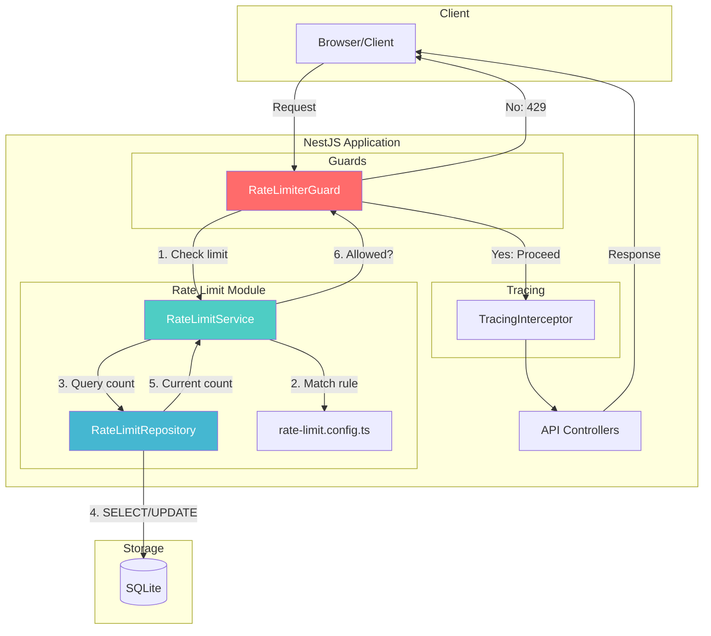
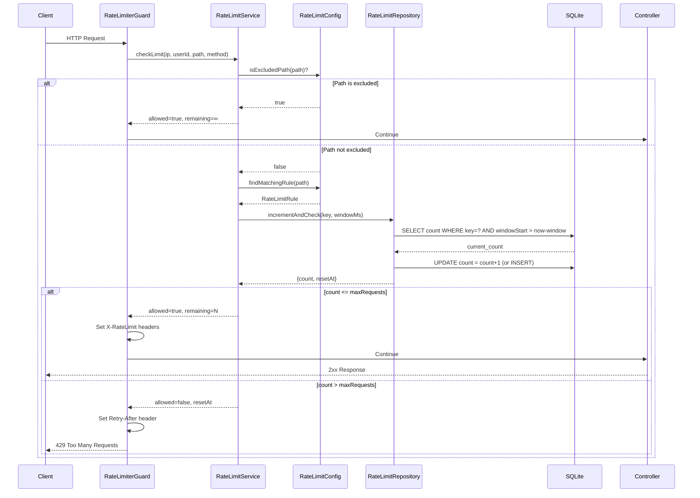

# Rate Limiting Architecture

## Overview

The rate limiting system protects API endpoints from abuse by limiting request frequency. It uses a sliding window algorithm with SQLite persistence for durability across restarts.

**ADR Reference:** [ADR-013: Rate Limiting and Advanced Visualization](../../decisions/ADR-013-rate-limiting-visualization.md)

---

## Architecture Diagram



## Request Flow

### Sequence Diagram



---

## Components

### RateLimiterGuard

**File:** `src/server/modules/rate-limit/rate-limiter.guard.ts`

Global guard applied via `APP_GUARD` to all routes. Responsibilities:

1. Extract client IP (handles `X-Forwarded-For` for proxied requests)
2. Extract user ID if authenticated
3. Call `RateLimitService.checkLimit()`
4. Set rate limit headers on all responses
5. Throw 429 if limit exceeded

**Key Headers Set:**

| Header                  | Description                       |
| ----------------------- | --------------------------------- |
| `X-RateLimit-Limit`     | Maximum requests per window       |
| `X-RateLimit-Remaining` | Requests remaining                |
| `X-RateLimit-Reset`     | Unix timestamp when window resets |
| `Retry-After`           | Seconds to wait (only on 429)     |

### RateLimitService

**File:** `src/server/modules/rate-limit/rate-limit.service.ts`

Core business logic:

1. **Rule Matching:** First-match wins from ordered rule list
2. **Key Generation:** Creates unique key based on strategy (IP, User, IP+User)
3. **Limit Checking:** Delegates to repository for count management
4. **Cleanup:** Scheduled task removes expired entries hourly

**Scheduled Tasks:**

| Cron       | Method                    | Purpose                         |
| ---------- | ------------------------- | ------------------------------- |
| Every hour | `cleanupExpiredEntries()` | Remove stale rate limit records |

### RateLimitRepository

**File:** `src/server/modules/rate-limit/rate-limit.repository.ts`

SQLite persistence layer:

1. **Atomic Increment:** Uses transactions for thread-safe counting
2. **Window Management:** Resets count when window expires
3. **Cleanup:** Bulk delete of expired entries

### RateLimitConfig

**File:** `src/server/modules/rate-limit/rate-limit.config.ts`

Configuration and utilities:

- `DEFAULT_RATE_LIMIT_RULES` - Ordered list of rules
- `RATE_LIMIT_EXCLUDED_PATHS` - Paths that bypass limiting
- `matchPath()` - Glob pattern matching
- `findMatchingRule()` - Rule lookup
- `generateKey()` - Key generation based on strategy

---

## Configuration

### Rule Structure

```typescript
interface RateLimitRule {
  path: string; // Glob pattern ("/api/blog/*", "/api/**")
  windowMs: number; // Time window in milliseconds
  maxRequests: number; // Max requests per window
  keyStrategy: 'ip' | 'user' | 'ip+user';
}
```

### Default Rules

| Path                 | Window | Max Requests | Strategy | Purpose                |
| -------------------- | ------ | ------------ | -------- | ---------------------- |
| `/api/auth/login`    | 1 min  | 5            | IP       | Brute force protection |
| `/api/auth/register` | 1 hour | 3            | IP       | Spam prevention        |
| `/api/blog`          | 1 min  | 10           | User     | Write rate limiting    |
| `/api/**`            | 1 min  | 100          | IP       | General protection     |

### Excluded Paths

These paths bypass rate limiting:

- `/api/health` - Health checks
- `/api/health/stream` - Health SSE
- `/api/traces/stream` - Trace SSE

---

## Database Schema

### rate_limit_entries Table

| Column        | Type      | Description                              |
| ------------- | --------- | ---------------------------------------- |
| `key`         | TEXT (PK) | Composite key (strategy:identifier:path) |
| `count`       | INTEGER   | Request count in current window          |
| `windowStart` | INTEGER   | Unix timestamp of window start           |
| `expiresAt`   | INTEGER   | Unix timestamp for cleanup               |
| `createdAt`   | INTEGER   | Record creation time                     |

---

## How to Extend

### Adding a New Rate Limit Rule

1. **Edit `rate-limit.config.ts`:**

```typescript
export const DEFAULT_RATE_LIMIT_RULES: RateLimitRule[] = [
  // Add your rule here - ORDER MATTERS (first match wins)
  {
    path: '/api/expensive-operation',
    windowMs: 60 * 1000, // 1 minute
    maxRequests: 3, // Very restrictive
    keyStrategy: 'user', // Per authenticated user
  },
  // ... existing rules
];
```

2. **Add integration test** in `rate-limit.integration.test.ts`

3. **Add E2E test** in `e2e/rate-limit.spec.ts`

### Adding a New Key Strategy

1. **Update types** in `rate-limit.types.ts`:

```typescript
keyStrategy: 'ip' | 'user' | 'ip+user' | 'custom';
```

2. **Update `generateKey()`** in `rate-limit.config.ts`:

```typescript
case 'custom':
  return `custom:${someIdentifier}:${path}`;
```

3. **Add tests** for the new strategy

### Excluding Additional Paths

Edit `RATE_LIMIT_EXCLUDED_PATHS` in `rate-limit.config.ts`:

```typescript
export const RATE_LIMIT_EXCLUDED_PATHS: string[] = [
  '/api/health',
  '/api/health/stream',
  '/api/traces/stream',
  '/api/public/*', // Add new exclusion
];
```

---

## Testing Patterns

### Unit Testing (Manual DI)

```typescript
describe('RateLimitService', () => {
  let service: RateLimitService;
  let mockRepository: jest.Mocked<IRateLimitRepository>;

  beforeEach(() => {
    mockRepository = {
      incrementAndCheck: jest.fn(),
      cleanupExpired: jest.fn(),
    };
    service = new RateLimitService(mockRepository);
  });

  it('should allow request under limit', async () => {
    mockRepository.incrementAndCheck.mockResolvedValue({
      count: 5,
      resetAt: Date.now() + 60000,
    });

    const result = await service.checkLimit(
      '192.168.1.1',
      undefined,
      '/api/blog',
      'GET',
    );

    expect(result.allowed).toBe(true);
    expect(result.remaining).toBe(95); // 100 - 5
  });
});
```

### Integration Testing

```typescript
describe('RateLimitService (Integration)', () => {
  let module: TestingModule;
  let service: IRateLimitService;

  beforeEach(async () => {
    module = await Test.createTestingModule({
      imports: [
        TypeOrmModule.forRoot({
          type: 'better-sqlite3',
          database: ':memory:',
          entities: [RateLimitEntry],
          synchronize: true,
        }),
        RateLimitModule,
      ],
    }).compile();

    service = module.get(TOKENS.IRateLimitService);
  });

  it('should increment count across multiple requests', async () => {
    // First request
    const result1 = await service.checkLimit(
      '192.168.1.1',
      undefined,
      '/api/test',
      'GET',
    );
    expect(result1.remaining).toBe(99);

    // Second request
    const result2 = await service.checkLimit(
      '192.168.1.1',
      undefined,
      '/api/test',
      'GET',
    );
    expect(result2.remaining).toBe(98);
  });
});
```

---

## Trace Integration

Rate-limited requests are recorded in the tracing system with:

- Status code: `429`
- Special metadata: `{ rateLimited: true, rule: 'ruleName' }`

This allows filtering rate-limited requests in the Traces dashboard.

---

## Future Enhancements

1. **Redis Backend** - For multi-instance deployments (see ADR-013)
2. **Method-Specific Rules** - Different limits for GET vs POST
3. **Bypass Tokens** - API keys that skip rate limiting
4. **Dynamic Rules** - Admin API for runtime rule changes
